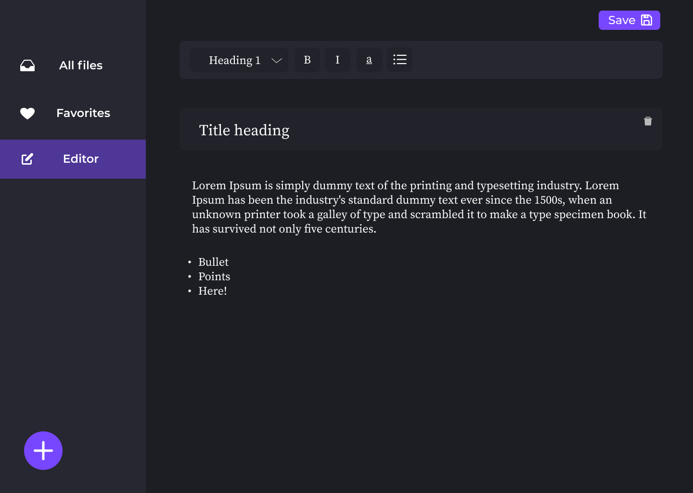
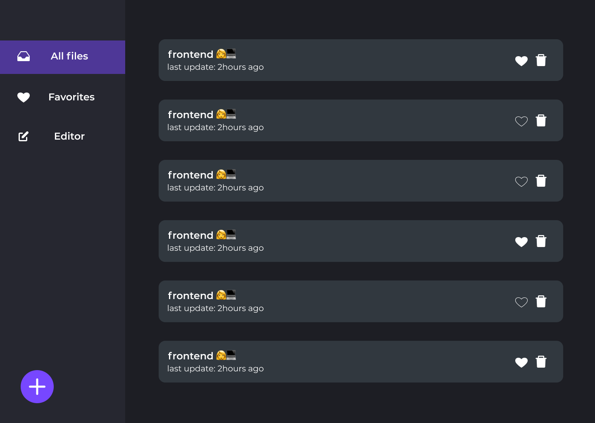

<h1 align="center" style="font-weight: bold;">Text Editor ✍</h1>


<p align="center">
 <a href="#tech">Technologies</a> • 
 <a href="#started">Getting Started</a> • 
 <a href="#contribute">Contribute</a> •
 <a href="#license">License</a>
</p>

<p align="center">
<b>This application is a online Text Editor, where users can create and edit markdown files.</b>
</p>

<p align="center">
    
    
</p>


<h2 id="tech">Technologies</h2>

### Client:
  Built using [React JS](https://pt-br.reactjs.org/), this interface and the layout ware made from scratch by me.

### API
  For building the server of this application, I used [Hy Graph](https://hygraph.com/) that is an CMS that allow us to build [GraphQL](https://graphql.org/) Content APIs.

<h2 id="started">🚀 Getting Started</h2>

<h4> Prerequisites</h4>

- Node 12
- Git 2

<h4>Install project</h4>

```
git clone https://github.com/Fernanda-Kipper/text-editor.git
npm install
```

<h4>Environment Variables</h4>

In the root of this project, create a `.env` file with the keys and values located on `.env.example`

To get these values you need to create an Account on [HyGraph](https://app.hygraph.com/) and then:

- Create a new project
- Inside your project, go to "Project Settings"
- Inside settings, access the tab "API Access"
- Add all permisions


- Copy your **Content API URL** and use as `process.env.REACT_APP_CONTENT_API_URL`


- Generate an Permanent Auth Tokens and use as `process.env.REACT_APP_CONTENT_API_TOKEN`


<h4>Start server</h4>

```
  //in root
  npm start
```

<h2 id="contribute">👩‍💻 Contribute</h2>

If you want to contribute, clone this repo, create your work branch and get your hands dirty!

```bash
git clone https://github.com/Fernanda-Kipper/text-editor.git
git checkout -b feature/NAME
```

 At the end, open a Pull Request explaining the problem solved or feature made, if exists, append screenshot of visual modifications and wait for the review!

[How to create a Pull Request](https://www.atlassian.com/br/git/tutorials/making-a-pull-request)

[Commit pattern](https://gist.github.com/joshbuchea/6f47e86d2510bce28f8e7f42ae84c716)


<h2 id="license">📃 License</h2>

This project is under [MIT](./.github/LICENSE) license


